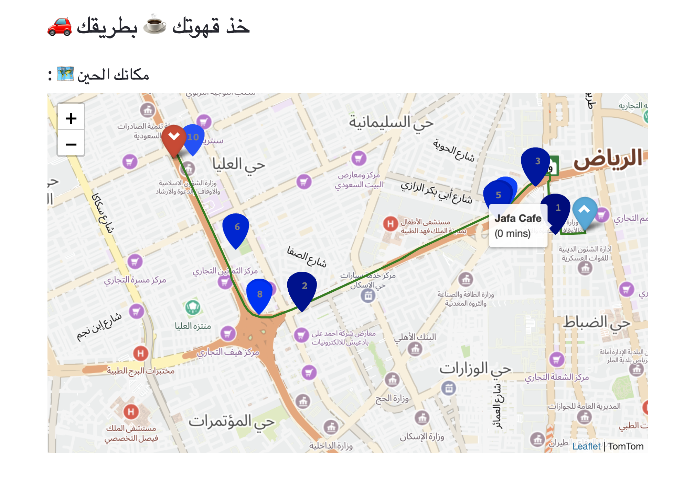

# Find Favorite Places Along your Route using TomTom Maps

<br>

## Overview

Finding the closest cafe while you are going to an interview will directly impact the interview outcome. Doing so will make you reach your destination on time and be respectful of interviewers' time. In addition, getting the caffeine that you need it to have full focus during the interview.

---
<br>

## Solution Structure:

Google Maps was the favorite and almost the single geolocation services worldwide for a long time.
Especially for developers, Google Maps API has for years been the go-to choice, but their expansive database of geographical changes this fact and pushed them for looking for cheaper alternatives provide the same services.

For this app, I've found several viable alternatives to Google Maps API to get geolocation data, such as TomTom, Mapfit, OpenLayers, HERE and Mapbox

You can find quick comparison among them in this article [5 Powerful Alternatives to Google Maps API](https://nordicapis.com/5-powerful-alternatives-to-google-maps-api/)

**Here we are going to use [TomTom api ](https://developer.tomtom.com/)**

>
  TomTom API main features:
    - Pretty Maps.
    - Good satellite navigation.
    - Provide good functionality such as display maps, locations search, traffic density and route finding
    - Price:
      1. Free for 2,500 requests daily.
      2. $0.42–$0.50 for each subsequent 1,000

Using TomTom maps we will provide app's users a pretty map that shows his current location. By providing the desired place category ex: cafe, car wash, etc. and destination location, the app will show all possible options for the selected category along his way.

---
<br>

## App Components / Services Types:
In this project, we are going to implement and provide following services:
1. App languages:
  - Arabic
  - English


<br>


2. Main map shows current user's location and provides clicking feature on anywhere on map to get Longitude and Latitude.


<br>


3. Place category: You can choose the place category that you are looking for along your way.

> List of categories we cover in our app:
  >- Café
  >- Restaurant
  > - Fast Food
  > - Market
  > - Bakery
  > - Grocery Store
  > - Bank
  >- ATM
  >- Gas Station
  >- Hospital
  >- Car Wash		
  >- Post Office		
  >- Hotel	School
  >- Clothing Shop		
  >- Mosque


<br>


4. Find destination using Location (Latitude/Longitude): Using this service, you can find the shortest route to your destination by providing Location's latitude and longitude.


<br>


5. Find destination using Area Name: Using this service, you can find the shortest route to your destination by providing Area name.


<br>


6. Max Detour time: After sepcfy both start and destination points, the app calculated the shortest route between them and highlight all possible places that belong to selected category with max detour time 3 minuits (this defualt value for detour time then you can change custmize to different value )


<br>


7. Result section:


<br>


By activating `yala` checkbox, the app will show the following information:

- Map section:
  - Home point (blue marker)
  - Destination point (red marker)
  - The shortest route between both points
  - (Rest of markers) that represent places belong to the selected category and these markers have the following features:
    - Each place marker has a number indicate the order of the place based on its detour time.
        - ex: the place with the shortest derout time will have number 1 then the second shortest place will have number 2 and so on.
    - Each place marker has a different color and size, they represent the place derout time
        - ex: the place with the shortest derout time will have the darkest color and bigger marker then the second shortest place be a little bit lighter and smaller and so on.
    - Each place has 2 popup windows:
        1. Popup window that showup when pressing on the marker to give you location's information (name, full address) .
        2. Popup window that showup when hovering over the marker to give you location's name and derout time.



- Side section: The app will show some information about the calculated route to the destination:
  - The time you need to reach your destination.
  - Estimated distance.
  - Estimated arrival time


<br>


---

### Prerequisites
The requirements.txt file contains any Python dependencies. You can install them by running this command:

```
pip3 install -r requirements.txt
```

### Built With

- [IBM Watson python lib](https://pypi.org/project/ibm-watson/) - Library to understand emotions and communication style in text.
- [Elasticsearch](https://www.elastic.co/products/elasticsearch) - Open-source, RESTful, distributed search and analytics engine
- [Flask](https://flask-doc.readthedocs.io/en/latest/)  - Web framework, a third-party Python library used for developing web applications.
- [Plotly](https://pypi.org/project/plotly/) - Open-source visualization libraries for R, Python, and JavaScript.

### How Run The Services
1. Clone repo
2. Run command on prerequisites section
3. Run `export FLASK_APP=app.py`
4. Run `flask run`


### Services Demo

- **Hotel Tone Analyzer**


- **Hotel Indexer**


