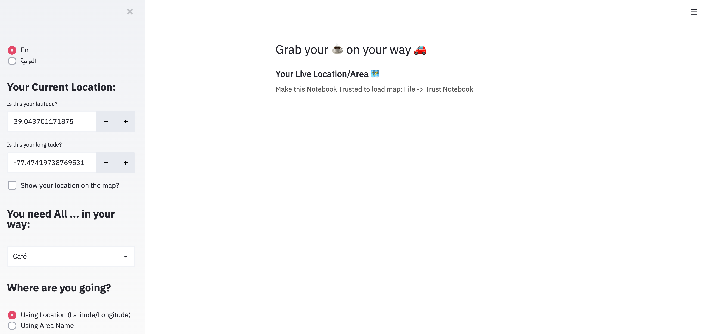

# Deploying streamlit app on Heroku

 

Followed steps on this [article](https://towardsdatascience.com/how-to-deploy-your-data-science-as-web-apps-easily-with-python-955dd462a9b5) to deploy our app on heroku, we got:

1. A security error prevents maps to showup as shown below

  with some search we found on [Streamlit github repo](https://github.com/streamlit/streamlit/issues/1514#issuecomment-636917260) that Streamlit doesn't directly support Folium at this time, and they work on it

 

2. As you can see, our **get current location**  function returns server latitude and longitude, we need to work on retrieving client IP to be able to get his location not server location.
